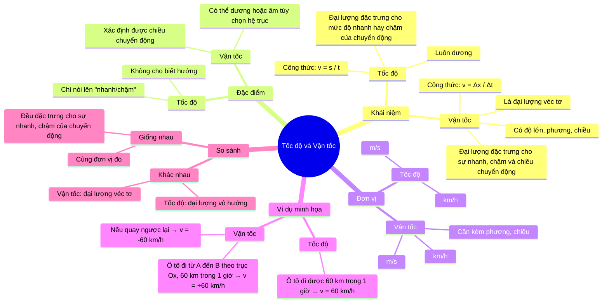

```mermaid
mindmap
  root((Tốc độ và Vận tốc))

    Khái niệm
      Tốc độ
        Đại lượng đặc trưng cho mức độ nhanh hay chậm của chuyển động
        Công thức: v = s / t
        Luôn dương
      Vận tốc
        Đại lượng đặc trưng cho sự nhanh, chậm và chiều chuyển động
        Là đại lượng véc tơ
        Có độ lớn, phương, chiều
        Công thức: v = Δx / Δt

    Đặc điểm
      Tốc độ
        Chỉ nói lên "nhanh/chậm"
        Không cho biết hướng
      Vận tốc
        Xác định được chiều chuyển động
        Có thể dương hoặc âm tùy chọn hệ trục

    Đơn vị
      Tốc độ
        m/s
        km/h
      Vận tốc
        m/s
        km/h
        Cần kèm phương, chiều

    Ví dụ minh họa
      Tốc độ
        Ô tô đi được 60 km trong 1 giờ → v = 60 km/h
      Vận tốc
        Ô tô đi từ A đến B theo trục Ox, 60 km trong 1 giờ → v = +60 km/h
        Nếu quay ngược lại → v = -60 km/h

    So sánh
      Giống nhau
        Đều đặc trưng cho sự nhanh, chậm của chuyển động
        Cùng đơn vị đo
      Khác nhau
        Tốc độ: đại lượng vô hướng
        Vận tốc: đại lượng véc tơ
```