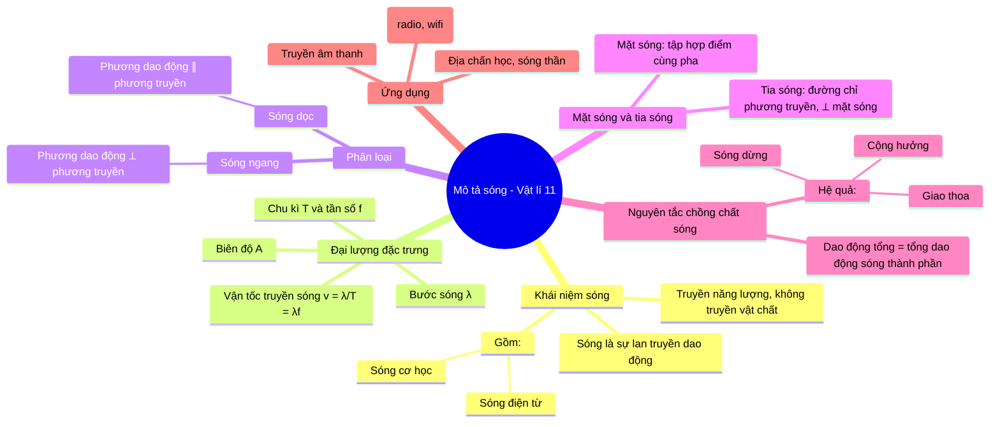

```mermaid
mindmap
  root((Mô tả sóng - Vật lí 11))

    Khái niệm sóng
      Sóng là sự lan truyền dao động
      Truyền năng lượng, không truyền vật chất
      Gồm:
        Sóng cơ học
        Sóng điện từ

    Đại lượng đặc trưng
      Bước sóng λ
      Chu kì T và tần số f
      Vận tốc truyền sóng v = λ/T = λf
      Biên độ A

    Phân loại
      Sóng ngang
        Phương dao động ⟂ phương truyền
      Sóng dọc
        Phương dao động ∥ phương truyền

    Mặt sóng và tia sóng
      Mặt sóng: tập hợp điểm cùng pha
      Tia sóng: đường chỉ phương truyền, ⟂ mặt sóng

    Nguyên tắc chồng chất sóng
      Dao động tổng = tổng dao động sóng thành phần
      Hệ quả:
        Giao thoa
        Sóng dừng
        Cộng hưởng

    Ứng dụng
      Truyền âm thanh
      Truyền thông tin (radio, wifi)
      Địa chấn học, sóng thần
```