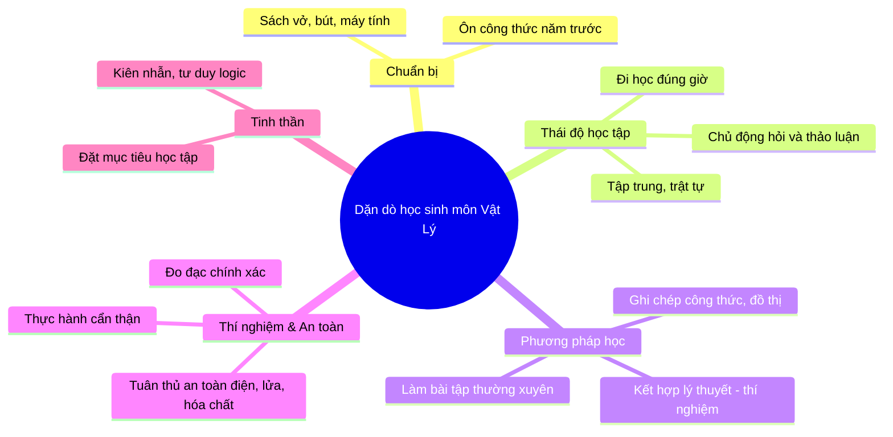

```mermaid
mindmap
  root((Dặn dò học sinh môn Vật Lý))

    Chuẩn bị
      Sách vở, bút, máy tính
      Ôn công thức năm trước

    Thái độ học tập
      Đi học đúng giờ
      Tập trung, trật tự
      Chủ động hỏi và thảo luận

    Phương pháp học
      Ghi chép công thức, đồ thị
      Làm bài tập thường xuyên
      Kết hợp lý thuyết - thí nghiệm

    Thí nghiệm & An toàn
      Thực hành cẩn thận
      Đo đạc chính xác
      Tuân thủ an toàn điện, lửa, hóa chất

    Tinh thần
      Kiên nhẫn, tư duy logic
      Đặt mục tiêu học tập
```