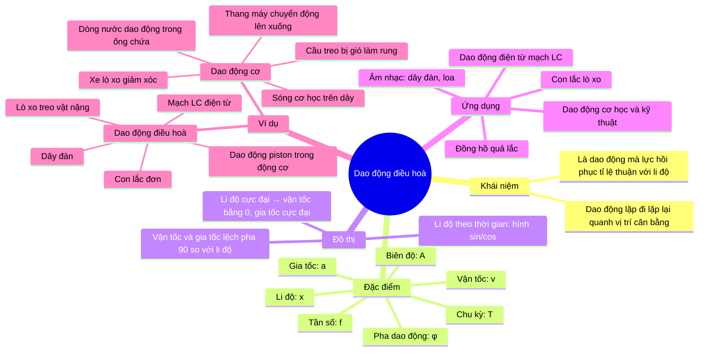

```mermaid
mindmap
  root((Dao động điều hoà))

    Khái niệm
      Là dao động mà lực hồi phục tỉ lệ thuận với li độ
      Dao động lặp đi lặp lại quanh vị trí cân bằng

    Đặc điểm
      Biên độ: A
      Tần số: f
      Chu kỳ: T
      Li độ: x
      Vận tốc: v
      Gia tốc: a
      Pha dao động: φ

   

    Đồ thị
      Li độ theo thời gian: hình sin/cos
      Vận tốc và gia tốc lệch pha 90 so với li độ
      Li độ cực đại → vận tốc bằng 0, gia tốc cực đại

    Ứng dụng
      Đồng hồ quả lắc
      Con lắc lò xo
      Dao động điện từ mạch LC
      Âm nhạc: dây đàn, loa
      Dao động cơ học và kỹ thuật

    Ví dụ
      Dao động điều hoà
        Con lắc đơn
        Lò xo treo vật nặng
        Mạch LC điện từ
        Dây đàn
        Dao động piston trong động cơ
      Dao động cơ
        Xe lò xo giảm xóc
        Cầu treo bị gió làm rung
        Thang máy chuyển động lên xuống
        Dòng nước dao động trong ống chứa
        Sóng cơ học trên dây


```