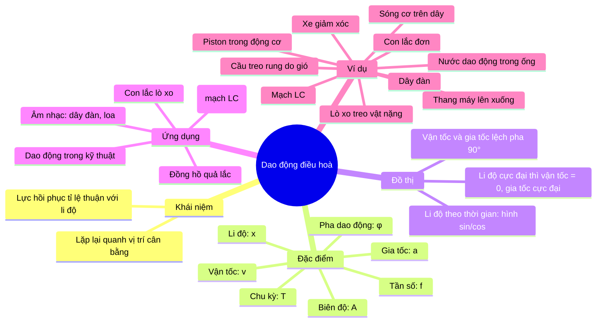

```mermaid
mindmap
  root((Dao động điều hoà))

    Khái niệm
      Lực hồi phục tỉ lệ thuận với li độ
      Lặp lại quanh vị trí cân bằng

    Đặc điểm
      Biên độ: A
      Tần số: f
      Chu kỳ: T
      Li độ: x
      Vận tốc: v
      Gia tốc: a
      Pha dao động: φ

    Đồ thị
      Li độ theo thời gian: hình sin/cos
      Vận tốc và gia tốc lệch pha 90°
      Li độ cực đại thì vận tốc = 0, gia tốc cực đại

    Ứng dụng
      Đồng hồ quả lắc
      Con lắc lò xo
      Dao động điện từ (mạch LC)
      Âm nhạc: dây đàn, loa
      Dao động trong kỹ thuật

    Ví dụ
      Con lắc đơn
      Lò xo treo vật nặng
      Mạch LC
      Dây đàn
      Piston trong động cơ
      Xe giảm xóc
      Cầu treo rung do gió
      Thang máy lên xuống
      Nước dao động trong ống
      Sóng cơ trên dây
```