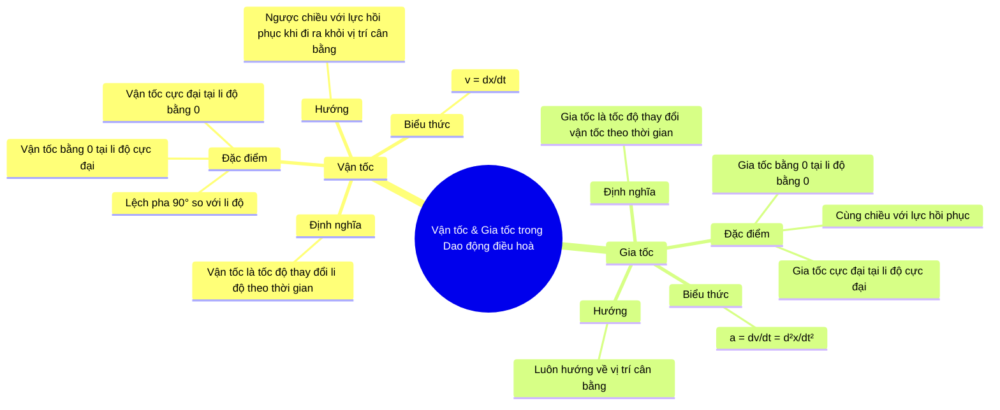

```mermaid
mindmap
  root((Vận tốc & Gia tốc trong Dao động điều hoà))

    Vận tốc
      Định nghĩa
        Vận tốc là tốc độ thay đổi li độ theo thời gian
      Biểu thức
        v = dx/dt
      Đặc điểm
        Vận tốc cực đại tại li độ bằng 0
        Vận tốc bằng 0 tại li độ cực đại
        Lệch pha 90° so với li độ
      Hướng
        Ngược chiều với lực hồi phục khi đi ra khỏi vị trí cân bằng

    Gia tốc
      Định nghĩa
        Gia tốc là tốc độ thay đổi vận tốc theo thời gian
      Biểu thức
        a = dv/dt = d²x/dt²
      Đặc điểm
        Gia tốc cực đại tại li độ cực đại
        Gia tốc bằng 0 tại li độ bằng 0
        Cùng chiều với lực hồi phục
      Hướng
        Luôn hướng về vị trí cân bằng

```