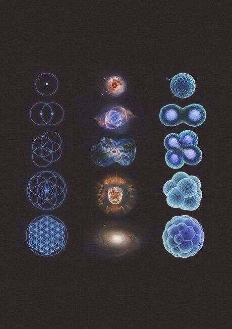

<p align="center">
  
</p>

[//]: # (  <a href=# target="_blank"></a>)

[//]: # (  <a href=# target="_blank"></a>)

[//]: # (  <a href="#"></a>)
<br>

## 🔥 News

- **Aug 20, 2025**: 🤗 Chúng tôi chính thức phát hành **PhysicsLab-1.0**, bộ công cụ mã nguồn mở cho mô phỏng các thí nghiệm Vật lí trong môi trường 3D với khả năng tương tác thời gian thực!  
- **December 10, 2025**: 👋 Chúng tôi công bố [báo cáo kỹ thuật](https://arxiv.org/pdf/) về **PhysicsSim-Next**, trình bày kiến trúc tính toán mới cho các bài toán động lực học phức tạp.  
- **Jun 28, 2026**: 🚀 Ra mắt **PhysicsEduXR**, hệ thống thí nghiệm ảo hỗ trợ XR (VR/AR/MR) dành cho dạy học phổ thông và đại học.  

> Tham gia **[Zalo](#)** và **[Discord](https://discord.gg/physicslab)** để cùng thảo luận, chia sẻ ý tưởng và nhận hỗ trợ từ cộng đồng.  

| Zalo Group                                    | Fanpage Facebook                                 | X                                          | Discord                                           |
|-----------------------------------------------|--------------------------------------------------|--------------------------------------------|---------------------------------------------------|
|  |  |  |  |  

---

## 🤗 Community Contribution Leaderboard
1. By [@edustemvn](https://github.com/aerovfx/Science)  
   - PhysicsLab-Tools: https://github.com/aerovfx/Science/tôls 
2. By [@OpenPhysicsXR](https://github.com/OpenPhysicsXR)  
   - PhysicsEduXR Unity Toolkit: https://github.com/OpenPhysicsXR/PhysicsEduXR-Unity  

---

## ☯️ **PhysicsLab 1.0**  

### Kiến trúc  

**PhysicsLab-1.0** là một hệ thống mô phỏng Vật lí đa nền tảng, cho phép:  
- 🔬 **Mô phỏng định luật cơ học, điện từ, dao động – sóng, quang học và hạt nhân** với tham số có thể điều chỉnh.  
- 🌌 **Hỗ trợ 3D và XR (AR/VR/MR)** để học sinh – sinh viên trải nghiệm các thí nghiệm ảo chân thực.  
- 📖 **Khả năng mở rộng**: cung cấp mã nguồn và bộ API để cộng đồng có thể phát triển thêm module cho các chủ đề nâng cao.  

<p align="center">
  
</p>  

### Hiệu năng  

Chúng tôi đã so sánh PhysicsLab-1.0 với một số phần mềm mô phỏng thương mại và mã nguồn mở.  
Kết quả cho thấy PhysicsLab-1.0 đạt độ chính xác cao hơn trong tính toán cơ học và dễ dàng tích hợp hơn trong môi trường học tập trực tuyến.  

| Công cụ                | Độ chính xác (Cơ học) | Giao diện XR | Tính mở rộng |
|-------------------------|----------------------|--------------|--------------|
| PhET Colorado           | 0.92                 | ❌            | Hạn chế      |
| Algodoo                | 0.89                 | ❌            | Trung bình   |
| PhysicsEduXR            | 0.93                 | ✅            | Trung bình   |
| **PhysicsLab-1.0**     | **0.97**             | **✅**        | **Mở rộng**  |  

---

## 🎁 Models Zoo  

PhysicsLab-1.0 hiện có sẵn 4 gói module:  

| Module                  | Mô tả                          | Ngày phát hành | Size | Tải về                                                                                  | 
|--------------------------|--------------------------------|----------------|------|-----------------------------------------------------------------------------------------| 
| Mechanics-v1             | Cơ học Newton, va chạm, dao động | 2025-08-20     | 1.2GB | [Download](https://huggingface.co/PhysicsLab/mechanics-v1)                              |
| Electromagnetism-v1      | Điện học – Từ học               | 2025-08-20     | 1.8GB | [Download](https://huggingface.co/PhysicsLab/electromagnetism-v1)                       |
| Optics-v1                | Quang học, giao thoa – nhiễu xạ | 2025-08-20     | 1.1GB | [Download](https://huggingface.co/PhysicsLab/optics-v1)                                 |
| Nuclear-v1               | Hạt nhân & phân rã              | 2025-08-20     | 2.0GB | [Download](https://huggingface.co/PhysicsLab/nuclear-v1)                                |  

---

## 🤗 Get Started with PhysicsLab  

PhysicsLab hỗ trợ **MacOS, Windows, Linux** và **thiết bị XR**.  

### Cài đặt yêu cầu  

```bash
pip install numpy scipy matplotlib
pip install -r requirements.txt
from physicslab.simulator import MechanicsSim
