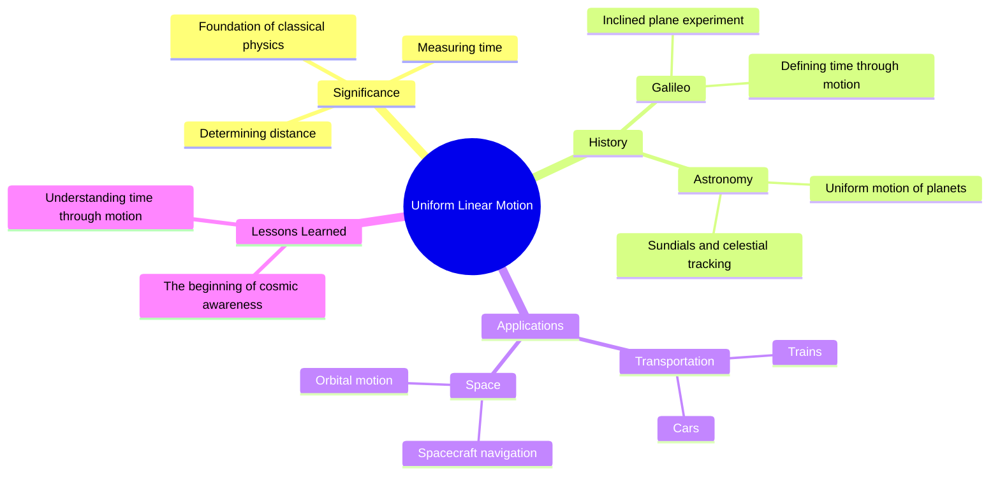

```mermaid
mindmap
  root((Uniform Linear Motion))
    Significance
      Measuring time
      Determining distance
      Foundation of classical physics
    History
      Galileo
        Inclined plane experiment
        Defining time through motion
      Astronomy
        Uniform motion of planets
        Sundials and celestial tracking
    Applications
      Transportation
        Trains
        Cars
      Space
        Orbital motion
        Spacecraft navigation
    Lessons Learned
      Understanding time through motion
      The beginning of cosmic awareness
```