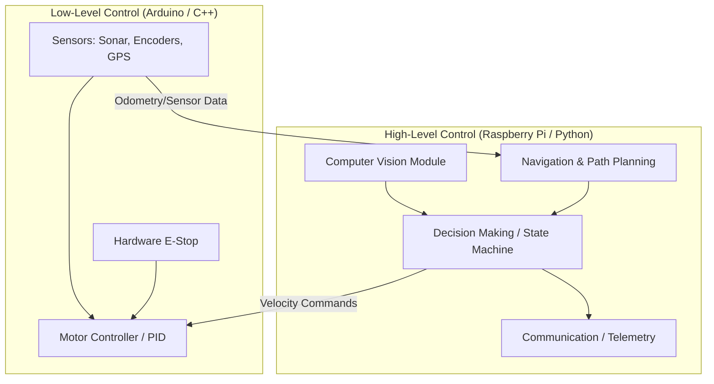

# Tuần 10: Dự Án Cuối Khoá & Demo Day / Week 10: Capstone Project & Demo Day

## Mục Tiêu / Objectives
Trong tuần cuối cùng này, học viên sẽ tổng hợp tất cả các kiến thức và kỹ năng đã học để hoàn thiện một dự án xe tự hành hoàn chỉnh. 
Mục tiêu chính là tích hợp các hệ thống con (điều khiển động cơ, định vị GPS, tránh vật cản, xử lý ảnh) thành một khối thống nhất và ổn định.
Học viên cũng sẽ chuẩn bị cho buổi bảo vệ dự án (Demo Day), nơi các bạn sẽ trình diễn sản phẩm và kỹ năng thuyết trình.
/ 
In this final week, students will synthesize all the knowledge and skills learned to complete a fully functional autonomous vehicle project.
The main objective is to integrate all subsystems (motor control, GPS navigation, obstacle avoidance, image processing) into a unified and stable unit.
Students will also prepare for the Capstone Demo Day, where they will demonstrate their products and presentation skills.

### Cụ thể / Specifics:
1. Hoàn thiện tích hợp phần cứng và phần mềm. / Complete hardware and software integration.
2. Lựa chọn và thực hiện một trong ba hướng dự án (Tracks). / Select and implement one of three project tracks.
3. Chẩn đoán và khắc phục các lỗi hệ thống phức tạp. / Diagnose and troubleshoot complex system errors.
4. Trình diễn khả năng vận hành thực tế của xe. / Demonstrate the vehicle's real-world operational capabilities.
5. Tìm hiểu về lộ trình nghề nghiệp trong lĩnh vực robotics. / Explore career pathways in the robotics field.

---

## Công Cụ & Phần Mềm / Tools & Software
- Xe tự hành đã lắp ráp hoàn chỉnh (Chassis, Raspberry Pi, Arduino, Camera, Lidar/Siêu âm, GPS, Động cơ, Pin).
  / Fully assembled autonomous vehicle (Chassis, Raspberry Pi, Arduino, Camera, Lidar/Ultrasonic, GPS, Motors, Battery).
- IDE lập trình (VS Code, Thonny, Arduino IDE).
  / Programming IDEs (VS Code, Thonny, Arduino IDE).
- SSH client để kết nối từ xa.
  / SSH client for remote connection.
- Các công cụ đo kiểm cơ bản (Đồng hồ vạn năng, dao động ký nếu cần).
  / Basic testing tools (Multimeter, oscilloscope if necessary).
- Sân bãi hoặc sa hình để thử nghiệm dự án.
  / Testing arena or track for project evaluation.

---

## Lý Thuyết / Theory

### 1. Kiến Trúc Hệ Thống Toàn Diện / Complete System Architecture
Kiến trúc của một xe tự hành (Autonomous Vehicle Architecture) bao gồm nhiều lớp giao tiếp với nhau.
Ở dưới cùng là phần cứng vật lý (Sensors & Actuators). Arduino đóng vai trò là Low-level Controller, thu thập tín hiệu cảm biến thô và điều khiển động cơ qua PWM.
Ở tầng trên, Raspberry Pi (High-level Controller) chạy Python, nhận dữ liệu, xử lý thuật toán SLAM/Computer Vision và ra quyết định (Decision Making).
/
The architecture of an autonomous vehicle consists of multiple interacting layers.
At the bottom is the physical hardware (Sensors & Actuators). The Arduino acts as the Low-level Controller, gathering raw sensor signals and controlling motors via PWM.
At the upper layer, the Raspberry Pi (High-level Controller) runs Python, ingesting data, processing SLAM/Computer Vision algorithms, and performing Decision Making.



### 2. Các Hướng Dự Án / Project Tracks
Học viên phải chọn một trong ba hướng dự án sau để tập trung phát triển trong tuần này.
/ 
Students must choose one of the following three project tracks to focus on developing this week.

#### Track A: Xe Khảo Sát Vườn / Garden Surveyor
- **Mô tả / Description:** Xe có nhiệm vụ di chuyển theo một lộ trình định sẵn bằng GPS trong môi trường ngoài trời (vườn, sân cỏ). Nó sẽ dừng lại tại các waypoint để chụp ảnh.
- **Yêu cầu kỹ thuật / Technical Req:** 
  - Tích hợp module GPS với độ chính xác cao.
  - Sử dụng la bàn số (Magnetometer) để định hướng.
  - Xử lý bù nhiễu do địa hình gồ ghề (sử dụng IMU).
- **Thách thức / Challenges:** Mất tín hiệu GPS khi có cây cối che khuất (GPS Multipath/No Fix); Bánh xe bị trượt trên cỏ làm sai lệch Odometry.

#### Track B: Giao Hàng Tự Động / Autonomous Delivery
- **Mô tả / Description:** Xe di chuyển từ điểm A đến điểm B trong môi trường hành lang hoặc sa hình trong nhà, mang theo một vật phẩm nhỏ. Nó phải tự động tránh chướng ngại vật động (người đi lại).
- **Yêu cầu kỹ thuật / Technical Req:**
  - Thuật toán DWA (Dynamic Window Approach) hoặc VFH (Vector Field Histogram) để tránh vật cản mượt mà.
  - Nhận diện biển báo (Stop sign, Turn left/right) bằng OpenCV.
  - Dừng chính xác tại đích đến.
- **Thách thức / Challenges:** Phản hồi với vật cản quá trễ (Obstacle latency) dẫn đến va chạm; Ánh sáng thay đổi làm sai lệch nhận diện camera.

#### Track C: Robot Hút Bụi (Roomba-style Cleaner)
- **Mô tả / Description:** Xe hoạt động trong một không gian kín, thực hiện thuật toán quét dọn phủ kín diện tích (Coverage Path Planning) như hình ziczac hoặc xoắn ốc.
- **Yêu cầu kỹ thuật / Technical Req:**
  - Cảm biến va chạm (Bumper switches) và cảm biến chống rơi (Cliff sensors).
  - Thuật toán Boustrophedon Cellular Decomposition.
  - Quản lý trạng thái (State machine): Đang quét, Va chạm, Quay về trạm sạc.
- **Thách thức / Challenges:** Góc quay không chính xác tích luỹ theo thời gian (Heading drift); Xe bị mắc kẹt ở các góc hẹp (Dead ends).

### 3. Hướng Dẫn Tích Hợp Hệ Thống / System Integration Checklist
Trước khi demo, hãy kiểm tra các hạng mục sau: / Before the demo, check the following items:

- [ ] **Nguồn điện (Power System):** Điện áp pin ổn định > 11.1V (đối với LiPo 3S). Có mạch giảm áp (BEC/Buck converter) cho Pi (5V-3A) và Arduino.
- [ ] **Phần sụn (Arduino Firmware):** Code được biên dịch và nạp thành công, không có vòng lặp vô hạn (blocking code) làm đứng máy.
- [ ] **Điều hướng Python (Python Nav):** Script chạy trên Pi khởi động tự động. Tốc độ khung hình camera > 15 FPS.
- [ ] **Khoá GPS (GPS Lock):** Nhận được tín hiệu từ ít nhất 4 vệ tinh (3D Fix) trước khi chạy chế độ tự động.
- [ ] **Độ trễ vật cản (Obstacle Latency):** Thời gian từ lúc cảm biến phát hiện vật cản đến lúc động cơ phanh < 150ms.
- [ ] **Dừng khẩn cấp (E-stop):** Nút bấm cứng và mềm (qua web/app) hoạt động ngay lập tức, cắt toàn bộ nguồn điện tới động cơ.

### 4. Gỡ Lỗi Nâng Cao / Advanced Troubleshooting
- **Lỗi: GPS không có tín hiệu (GPS no fix).** 
  - *Giải pháp:* Đưa xe ra không gian quang đãng, tránh toà nhà cao tầng. Kiểm tra baudrate của module (thường là 9600 hoặc 115200). Đảm bảo anten ngửa lên trời.
- **Lỗi: Động cơ dao động, xe đi ziczac (Motor oscillation).**
  - *Giải pháp:* Chỉnh lại thông số PID. Giảm KP (Proportional) xuống 20% và tăng KD (Derivative) để giảm độ vọt lố (overshoot). Kiểm tra xem bánh xe có bị lỏng không.
- **Lỗi: Cảm biến siêu âm báo vật cản giả (Obstacle false positives).**
  - *Giải pháp:* Cảm biến có thể nhận tín hiệu dội từ mặt đất. Lắp cảm biến cao hơn hoặc ngửa lên một góc 5 độ. Sử dụng bộ lọc Median (Median filter) trong code để loại bỏ nhiễu.

### 5. Định Dạng Demo Day / Demo Day Format
Mỗi nhóm sẽ có 10-15 phút để thể hiện. / Each group has 10-15 minutes to present.
1. **5 phút Thuyết trình (Presentation):** Trình bày về kiến trúc hệ thống, những khó khăn đã gặp và cách giải quyết.
2. **5 phút Chạy thực tế (Live run):** Đặt xe vào sa hình hoặc sân thử nghiệm. Bật công tắc và để xe tự chạy hoàn toàn không can thiệp.
3. **5 phút Hỏi đáp (Q&A):** Ban giám khảo và các bạn học viên khác đặt câu hỏi về thuật toán và thiết kế.

### 6. Lộ Trình Nghề Nghiệp & Bước Tiếp Theo / Career Paths & Next Steps
Sau khoá học này, bạn có thể theo đuổi các vị trí:
- **Kỹ sư Robotics (Robotics Engineer):** Thiết kế phần cứng và lập trình nhúng.
- **Lập trình viên Xe Tự Hành (Autonomous Vehicle Developer):** Tập trung vào thuật toán điều hướng và an toàn.
- **Lập trình viên ROS (ROS Developer):** Sử dụng Robot Operating System trong công nghiệp.

**Bước tiếp theo (Next steps):**
- Học ROS2 (Robot Operating System 2) để quản lý hệ thống phân tán.
- Áp dụng SLAM (Simultaneous Localization and Mapping) bằng Lidar 2D/3D.
- Ứng dụng Deep Learning (YOLO, CNN) để nhận diện đối tượng thay vì kỹ thuật CV truyền thống.
- Nghiên cứu V2X Communication (Giao tiếp giữa xe với xe và hạ tầng).

---

## Code Python / Python Code
Dưới đây là mã nguồn chính cho Raspberry Pi, tích hợp tất cả các module.
/ Below is the main source code for the Raspberry Pi, integrating all modules.

```python
#!/usr/bin/env python3
# -*- coding: utf-8 -*-
"""
AutonomousVehicle main.py
Tích hợp điều hướng, camera, cảm biến và giao tiếp Serial với Arduino.
Integrates navigation, camera, sensors, and Serial communication with Arduino.
"""

import serial
import time
import cv2
import numpy as np
import threading
import math
import logging

# Cấu hình logging / Logging configuration
logging.basicConfig(level=logging.INFO, format='%(asctime)s - %(levelname)s - %(message)s')

class AutonomousVehicle:
    def __init__(self, serial_port='/dev/ttyACM0', baud_rate=115200):
        """
        Khởi tạo hệ thống xe tự hành.
        Initialize the autonomous vehicle system.
        """
        self.serial_port = serial_port
        self.baud_rate = baud_rate
        self.running = False
        self.arduino = None
        
        # Trạng thái hiện tại của xe / Current state of the vehicle
        self.state = {
            'distance_front': 999.0, # Khoảng cách vật cản phía trước (cm)
            'gps_lat': 0.0,
            'gps_lon': 0.0,
            'heading': 0.0,
            'speed': 0.0
        }
        
        self.lock = threading.Lock()
        
    def connect_serial(self):
        """Kết nối tới Arduino / Connect to Arduino"""
        try:
            self.arduino = serial.Serial(self.serial_port, self.baud_rate, timeout=1)
            time.sleep(2) # Chờ Arduino reset / Wait for Arduino to reset
            logging.info("Connected to Arduino successfully.")
        except Exception as e:
            logging.error(f"Failed to connect to Arduino: {e}")
            raise

    def serial_read_loop(self):
        """
        Luồng liên tục đọc dữ liệu từ Arduino.
        Continuous thread to read data from Arduino.
        """
        while self.running:
            if self.arduino and self.arduino.in_waiting > 0:
                try:
                    line = self.arduino.readline().decode('utf-8').strip()
                    # Parse dữ liệu (giả sử định dạng: D:15.5,H:90,L:21.0,N:105.0)
                    # Parse data (assuming format: D:15.5,H:90,L:21.0,N:105.0)
                    parts = line.split(',')
                    with self.lock:
                        for p in parts:
                            if p.startswith('D:'):
                                self.state['distance_front'] = float(p.split(':')[1])
                            elif p.startswith('H:'):
                                self.state['heading'] = float(p.split(':')[1])
                            elif p.startswith('L:'):
                                self.state['gps_lat'] = float(p.split(':')[1])
                            elif p.startswith('N:'):
                                self.state['gps_lon'] = float(p.split(':')[1])
                except Exception as e:
                    logging.warning(f"Serial parse error: {e}")
            time.sleep(0.01)

    def send_command(self, left_speed, right_speed):
        """
        Gửi lệnh điều khiển động cơ tới Arduino.
        Send motor control commands to Arduino.
        """
        if self.arduino:
            # Gửi dạng: M,left,right\n
            cmd = f"M,{int(left_speed)},{int(right_speed)}\n"
            self.arduino.write(cmd.encode())

    def camera_loop(self):
        """
        Luồng xử lý hình ảnh (ví dụ nhận diện làn đường hoặc biển báo).
        Image processing thread (e.g. lane or sign detection).
        """
        cap = cv2.VideoCapture(0)
        cap.set(cv2.CAP_PROP_FRAME_WIDTH, 320)
        cap.set(cv2.CAP_PROP_FRAME_HEIGHT, 240)
        
        while self.running:
            ret, frame = cap.read()
            if not ret:
                continue
                
            # Xử lý ảnh cơ bản: chuyển sang xám và làm mờ
            # Basic processing: convert to grayscale and blur
            gray = cv2.cvtColor(frame, cv2.COLOR_BGR2GRAY)
            blur = cv2.GaussianBlur(gray, (5, 5), 0)
            
            # Thêm các thuật toán CV phức tạp ở đây (ví dụ dò line)
            # Add complex CV algorithms here (e.g., line following)
            
            # Hiển thị cho mục đích debug / Display for debugging
            # cv2.imshow("Camera View", blur)
            # if cv2.waitKey(1) & 0xFF == ord('q'):
            #     break
            time.sleep(0.03) # Limit to ~30 FPS
            
        cap.release()
        cv2.destroyAllWindows()

    def main_navigation_loop(self):
        """
        Vòng lặp điều hướng chính (State machine & Decision making).
        Main navigation loop.
        """
        logging.info("Starting main navigation loop...")
        while self.running:
            with self.lock:
                dist = self.state['distance_front']
                
            # Logic tránh vật cản (Obstacle Avoidance Logic)
            if dist < 20.0:
                logging.warning(f"Obstacle detected at {dist} cm! Stopping.")
                self.send_command(0, 0)
                time.sleep(0.5)
                # Lùi lại và xoay / Reverse and turn
                self.send_command(-100, -100)
                time.sleep(1.0)
                self.send_command(150, -150) # Xoay phải / Turn right
                time.sleep(0.5)
            elif dist < 50.0:
                logging.info("Approaching obstacle, slowing down.")
                self.send_command(80, 80)
            else:
                # Chạy thẳng / Move forward
                self.send_command(150, 150)
                
            time.sleep(0.1)

    def start(self):
        """Khởi động toàn bộ hệ thống / Start the entire system"""
        self.connect_serial()
        self.running = True
        
        # Khởi tạo các luồng (Threads)
        self.t_serial = threading.Thread(target=self.serial_read_loop, daemon=True)
        self.t_camera = threading.Thread(target=self.camera_loop, daemon=True)
        self.t_nav = threading.Thread(target=self.main_navigation_loop, daemon=True)
        
        self.t_serial.start()
        self.t_camera.start()
        self.t_nav.start()
        
        logging.info("System is running. Press Ctrl+C to stop.")
        try:
            while self.running:
                time.sleep(1)
        except KeyboardInterrupt:
            logging.info("E-Stop triggered by User (Ctrl+C).")
            self.stop()

    def stop(self):
        """Dừng xe an toàn / Stop vehicle safely"""
        self.running = False
        self.send_command(0, 0)
        time.sleep(0.5)
        if self.arduino:
            self.arduino.close()
        logging.info("System stopped.")

if __name__ == "__main__":
    vehicle = AutonomousVehicle()
    vehicle.start()
```

---

## Code Arduino / Arduino Code
Dưới đây là Firmware cho Arduino, làm nhiệm vụ Low-level controller.
/ Below is the Firmware for Arduino, acting as the Low-level controller.

```cpp
/*
 * Autonomous Vehicle Low-Level Firmware (Week 10)
 * Reads sensors and controls motors. Communicates via Serial.
 */

#include <NewPing.h> // Thư viện cho cảm biến siêu âm / Ultrasonic library

// Khai báo chân cảm biến / Sensor pins
#define TRIGGER_PIN  12
#define ECHO_PIN     11
#define MAX_DISTANCE 200

// Khai báo chân động cơ (Dùng module L298N) / Motor pins (L298N)
#define ENA 5
#define IN1 6
#define IN2 7
#define IN3 8
#define IN4 9
#define ENB 10

NewPing sonar(TRIGGER_PIN, ECHO_PIN, MAX_DISTANCE);

// Biến lưu trữ tốc độ / Speed variables
int leftSpeed = 0;
int rightSpeed = 0;
unsigned long lastUpdate = 0;

void setup() {
  Serial.begin(115200);
  
  // Cấu hình chân động cơ / Configure motor pins
  pinMode(ENA, OUTPUT);
  pinMode(IN1, OUTPUT);
  pinMode(IN2, OUTPUT);
  pinMode(IN3, OUTPUT);
  pinMode(IN4, OUTPUT);
  pinMode(ENB, OUTPUT);
  
  // Dừng động cơ ban đầu / Stop motors initially
  stopMotors();
}

void loop() {
  // 1. Đọc cảm biến định kỳ (50ms) / Read sensors periodically
  if (millis() - lastUpdate > 50) {
    lastUpdate = millis();
    
    float dist = (float)sonar.ping_cm();
    if (dist == 0) dist = 999.0; // Không thấy vật cản / No obstacle
    
    // Giả lập dữ liệu GPS và Heading (Trong thực tế cần module GPS/IMU thật)
    // Simulating GPS/Heading data (Real hardware needed in practice)
    float heading = 90.0;
    float lat = 21.0285;
    float lon = 105.8542;
    
    // Gửi dữ liệu lên Raspberry Pi / Send telemetry to Pi
    Serial.print("D:"); Serial.print(dist);
    Serial.print(",H:"); Serial.print(heading);
    Serial.print(",L:"); Serial.print(lat, 4);
    Serial.print(",N:"); Serial.println(lon, 4);
  }
  
  // 2. Lắng nghe lệnh điều khiển từ Pi / Listen for commands from Pi
  if (Serial.available() > 0) {
    String cmd = Serial.readStringUntil('\n');
    parseCommand(cmd);
  }
}

void parseCommand(String cmd) {
  // Định dạng lệnh: M,LeftSpeed,RightSpeed (VD: M,150,150)
  // Command format: M,LeftSpeed,RightSpeed (e.g. M,150,150)
  if (cmd.charAt(0) == 'M') {
    int firstComma = cmd.indexOf(',');
    int secondComma = cmd.indexOf(',', firstComma + 1);
    
    if (firstComma > 0 && secondComma > 0) {
      String strL = cmd.substring(firstComma + 1, secondComma);
      String strR = cmd.substring(secondComma + 1);
      
      leftSpeed = strL.toInt();
      rightSpeed = strR.toInt();
      
      applyMotorSpeed();
    }
  }
}

void applyMotorSpeed() {
  // Logic điều khiển động cơ trái / Left motor logic
  if (leftSpeed >= 0) {
    digitalWrite(IN1, HIGH);
    digitalWrite(IN2, LOW);
    analogWrite(ENA, constrain(leftSpeed, 0, 255));
  } else {
    digitalWrite(IN1, LOW);
    digitalWrite(IN2, HIGH);
    analogWrite(ENA, constrain(-leftSpeed, 0, 255));
  }
  
  // Logic điều khiển động cơ phải / Right motor logic
  if (rightSpeed >= 0) {
    digitalWrite(IN3, HIGH);
    digitalWrite(IN4, LOW);
    analogWrite(ENB, constrain(rightSpeed, 0, 255));
  } else {
    digitalWrite(IN3, LOW);
    digitalWrite(IN4, HIGH);
    analogWrite(ENB, constrain(-rightSpeed, 0, 255));
  }
}

void stopMotors() {
  analogWrite(ENA, 0);
  analogWrite(ENB, 0);
  digitalWrite(IN1, LOW);
  digitalWrite(IN2, LOW);
  digitalWrite(IN3, LOW);
  digitalWrite(IN4, LOW);
}
```

---

## Bài Tập / Exercises
1. Tích hợp E-stop phần cứng (Hardware E-stop): Thêm một nút nhấn vật lý màu đỏ lớn trên xe. Khi nhấn, nó phải cắt trực tiếp nguồn điện của L298N mà không cần thông qua phần mềm.
   / Add a physical red button. When pressed, it must cut L298N power directly, bypassing software.
2. Tối ưu hoá luồng Camera (Camera Optimization): Sửa lại `main.py` để sử dụng đa luồng hiệu quả hơn, đảm bảo xử lý ảnh không làm nghẽn quá trình nhận lệnh Serial.
   / Modify `main.py` to use multithreading more efficiently, ensuring CV doesn't block Serial commands.
3. Cải thiện bộ lọc siêu âm (Ultrasonic Filter): Viết thêm hàm trong Arduino để lấy trung vị (median) của 5 lần đọc siêu âm gần nhất nhằm loại bỏ các giá trị nhiễu.
   / Write a function in Arduino to get the median of 5 sonar readings to remove noise.

---

## Câu Hỏi Thảo Luận / Discussion (5)
1. Tại sao chúng ta lại chia kiến trúc thành Low-level (Arduino) và High-level (Pi) thay vì dùng một vi điều khiển duy nhất?
   / Why do we split the architecture into Low-level and High-level instead of a single MCU?
2. Giữa Lidar và Siêu âm (Ultrasonic), cảm biến nào tốt hơn cho xe tự hành ngoài trời và tại sao?
   / Between Lidar and Ultrasonic, which is better for outdoor vehicles and why?
3. Khi GPS mất tín hiệu, phương pháp nào có thể giúp xe tiếp tục di chuyển đúng hướng trong thời gian ngắn?
   / When GPS is lost, what methods help the vehicle stay on track for a short time?
4. Hiện tượng "Heading drift" là gì và nó ảnh hưởng thế nào đến dự án Track C (Robot hút bụi)?
   / What is "Heading drift" and how does it affect Track C?
5. Nếu thời gian xử lý ảnh (Camera framerate) giảm xuống dưới 5 FPS, điều gì sẽ xảy ra với khả năng tránh vật cản của xe?
   / If CV framerate drops below 5 FPS, what happens to obstacle avoidance?

---

## Bài Về Nhà / Homework
- Chuẩn bị Slide thuyết trình (Pitch deck) cho Demo Day. Slide cần có: Tên nhóm, Ý tưởng, Sơ đồ khối, Video quay lại quá trình thử nghiệm thành công (hoặc thất bại và bài học).
  / Prepare the Pitch Deck for Demo Day. Include: Team name, Idea, Block diagram, Test videos.
- Review lại toàn bộ code và bổ sung các comment giải thích (Documentation).
  / Review all code and add explanatory comments.
- Sạc đầy tất cả pin LiPo và chuẩn bị phương án pin dự phòng cho buổi Demo.
  / Fully charge all LiPo batteries and prepare backups for Demo Day.

---

## Đánh Giá / Assessment Rubric
Dự án sẽ được chấm điểm theo thang điểm 100, dựa trên các tiêu chí sau:
/ The project is graded on a 100-point scale based on the following criteria:

| Tiêu Chí / Criteria | Chi Tiết / Details | Điểm Tối Đa / Max Pts |
| :--- | :--- | :---: |
| **Phần cứng (Hardware)** | Đi dây gọn gàng, hàn chắc chắn, khung gầm vững, bố trí cảm biến hợp lý. / Clean wiring, solid chassis, sensible sensor placement. | 20 |
| **Phần mềm (Software)** | Code sạch, chia module rõ ràng, không crash, có comment đầy đủ. / Clean code, modular, no crashes, well-commented. | 20 |
| **Tính tự hành (Autonomy)** | Xe tự di chuyển mượt mà, phản ứng đúng với vật cản/yêu cầu của Track đã chọn. / Smooth movement, correct reaction to obstacles/track reqs. | 30 |
| **Độ ổn định (Robustness)** | Xe không bị restart giữa chừng, có cơ chế an toàn (E-stop hoạt động). / No random restarts, functional E-stop. | 15 |
| **Thuyết trình (Presentation)** | Trình bày rõ ràng, slide đẹp, trả lời câu hỏi phản biện thuyết phục. / Clear presentation, good slides, strong Q&A. | 15 |
| **Tổng Cộng (Total)** | | **100** |

Chúc các bạn có một kỳ Demo Day thật thành công và tự hào về chiếc xe tự hành đầu tiên của mình!
/ Wishing you a very successful Demo Day, be proud of your first autonomous vehicle!
