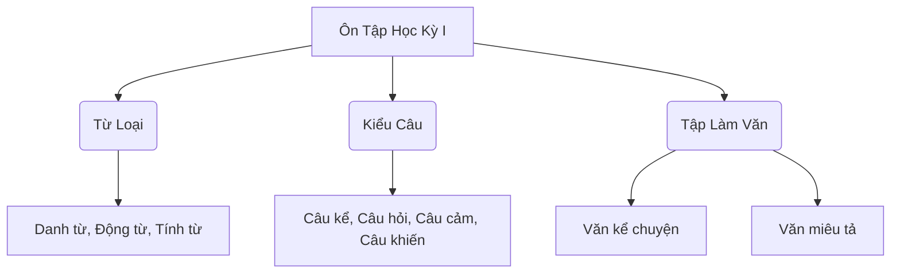

# Tuần 5: Bài 9 (Tài năng của em) & Ôn Tập Tổng Kết Học Kỳ I

## 🎯 1. Mục Tiêu Bài Học (Learning Objectives)

### Đọc hiểu (Reading)
- **Tiếng Việt:** Rèn luyện kỹ năng đọc to, rõ ràng, diễn cảm các văn bản. Khả năng tìm kiếm thông tin, hiểu ý chính và suy luận từ văn bản: *Các câu chuyện khuyến khích phát triển năng khiếu, sự kiên trì luyện tập*.
- **English:** Develop read-aloud fluency and reading comprehension skills. Identify main ideas, extract details, and make inferences from texts related to: *Các câu chuyện khuyến khích phát triển năng khiếu, sự kiên trì luyện tập*.

### Luyện từ và câu (Vocabulary & Grammar)
- **Tiếng Việt:** Nắm vững cấu trúc ngữ pháp và từ vựng: *Ôn tập tổng hợp Danh từ, Động từ, Tính từ, Phân loại câu và Dấu câu*.
- **English:** Master grammar rules and expand vocabulary: *Ôn tập tổng hợp Danh từ, Động từ, Tính từ, Phân loại câu và Dấu câu*.

### Viết (Writing)
- **Tiếng Việt:** Rèn kỹ năng viết theo đúng thể loại: *Bài văn miêu tả hoàn chỉnh (Tả người hoặc tả cảnh) chuẩn văn phong lớp 4*.
- **English:** Practice writing genres and essay structuring: *Bài văn miêu tả hoàn chỉnh (Tả người hoặc tả cảnh) chuẩn văn phong lớp 4*.

### Nói và nghe (Speaking & Listening)
- **Tiếng Việt:** Tự tin trình bày quan điểm, kể chuyện rõ ràng: *Giới thiệu tài năng/năng khiếu của bản thân (vẽ, hát, chơi đàn, đá bóng) kèm minh họa*.
- **English:** Speak confidently, practice active listening and storytelling: *Giới thiệu tài năng/năng khiếu của bản thân (vẽ, hát, chơi đàn, đá bóng) kèm minh họa*.

---

## 📚 2. Liên Kết Sách Giáo Khoa (Textbook Units)
- **Chương trình (Curriculum):** Tiếng Việt 4 - Kết Nối Tri Thức Với Cuộc Sống (Tập 1)
- **Bài học (Lessons):** Tuần 5: Bài 9 (Tài năng của em) & Ôn Tập Tổng Kết Học Kỳ I

---

## 💻 3. Công Cụ Hỗ Trợ Học Tập (EdTech & Digital Humanities Lab)

| Kỹ năng (Skill) | Công cụ EdTech / Lập trình (Tech Tool) | Ứng dụng trong bài (Application) |
|-----------------|----------------------------------------|----------------------------------|
| Sáng tạo (Creative) | Audacity Audio Recording (Ghi âm đọc diễn cảm) & Python Grammar Quiz | Hỗ trợ học sinh trực quan hóa ý tưởng và ứng dụng lập trình vào xử lý ngôn ngữ. |

---

## 📖 4. Lý Thuyết Chuyên Sâu (Language & Literary Theory)

### 1. Ôn tập Từ loại (Parts of Speech Review)
- **Danh từ:** Từ chỉ sự vật (Bầu trời, quyển sách, dòng sông).
- **Động từ:** Từ chỉ hoạt động, trạng thái (Bay, chạy, đứng, suy nghĩ).
- **Tính từ:** Từ chỉ đặc điểm, tính chất (Xanh thẳm, cao vút, thông minh).

### 2. Ôn tập Câu (Sentence Types Review)
- Câu kể (.) - Cung cấp thông tin.
- Câu hỏi (?) - Tìm kiếm thông tin.
- Câu cảm (!) - Bộc lộ cảm xúc.
- Câu khiến (!/.) - Yêu cầu, ra lệnh.

### 3. Cấu trúc bài văn miêu tả (Descriptive Essay Structure)
- **Mở bài:** Giới thiệu đối tượng miêu tả (người hoặc cảnh).
- **Thân bài:** 
  - Tả bao quát (Hình dáng chung / Quang cảnh chung).
  - Tả chi tiết (Các bộ phận nổi bật / Sự thay đổi của cảnh theo thời gian).
- **Kết bài:** Nêu tình cảm, cảm xúc hoặc suy nghĩ về đối tượng được tả.
        
---

## 📊 5. Sơ Đồ Tư Duy (Mindmap & Diagrams)


        
---

## 🐍 6. Python Lab (Lập Trình Xử Lý Ngôn Ngữ)

```python
# Python Grammar Quiz (Trắc nghiệm ngữ pháp)
def run_quiz():
    questions = [
        {"q": "Từ 'xinh đẹp' là loại từ gì?", "options": ["A. Danh từ", "B. Động từ", "C. Tính từ"], "answer": "C"},
        {"q": "Câu 'Chà, bông hoa này đẹp quá!' là kiểu câu gì?", "options": ["A. Câu kể", "B. Câu cảm", "C. Câu hỏi"], "answer": "B"}
    ]
    
    score = 0
    print("--- BÀI KIỂM TRA NGỮ PHÁP (Grammar Quiz) ---")
    for i, q in enumerate(questions):
        print(f"Câu {i+1}: {q['q']}")
        for opt in q['options']:
            print(opt)
        ans = input("Nhập đáp án (A, B, hoặc C): ").strip().upper()
        # Mocking user input for script output
        ans = q['answer'] 
        if ans == q['answer']:
            print("Chính xác!")
            score += 1
        else:
            print("Sai rồi!")
        print("-" * 10)
    print(f"Điểm của bạn: {score}/{len(questions)}")

# run_quiz()
```
        
---

## 🗣️ 7. Câu Hỏi Thảo Luận & Luyện Nói (Discussion & Speaking Prompts)

1. **Câu hỏi:** Em có năng khiếu hay sở trường gì đặc biệt không?
   *Trả lời:* Em có khả năng ghi nhớ nốt nhạc rất nhanh và chơi đàn piano.
2. **Câu hỏi:** Để phát triển tài năng, ngoài năng khiếu bẩm sinh ta cần thêm điều gì?
   *Trả lời:* Ta cần sự kiên trì luyện tập chăm chỉ mỗi ngày, không ngại khó khăn.
3. **Câu hỏi:** Đặt một câu có đủ danh từ, động từ và tính từ.
   *Trả lời:* Con mèo (danh từ) mướp đang ngủ (động từ) say sưa (tính từ).
4. **Câu hỏi:** Em thích nhất bài học nào trong học kỳ I vừa qua? Vì sao?
   *Trả lời:* Em thích nhất bài học về bảo vệ môi trường vì nó giúp em hiểu thêm về thế giới tự nhiên.
5. **Câu hỏi:** Tại sao ôn tập lại quan trọng trước khi thi?
   *Trả lời:* Để củng cố lại kiến thức, nhớ lâu hơn và tự tin hơn khi làm bài.
        
---


## 💡 Các Lỗi Thường Gặp & Mẹo Viết (Common Primary Student Mistakes & Writing Tips)

### Lỗi Chính Tả (Spelling Errors)
1. **Lỗi âm đầu (Initial Consonants):** Học sinh thường nhầm lẫn giữa *tr/ch*, *s/x*, *r/d/gi*.
   - *Ví dụ sai:* chong xáng, xuy nghĩ.
   - *Sửa lại:* trong sáng, suy nghĩ.
   - *Mẹo (Tip):* Luyện đọc nhiều, chú ý nghĩa của từ. Ví dụ: từ chỉ sự vật thường bắt đầu bằng "ch" (chó, chim), từ chỉ hoạt động thường bắt đầu bằng "tr" (trèo, chạy - ngoại lệ).
2. **Lỗi vần (Vowels/Endings):** Nhầm lẫn *an/ang*, *at/ac*, *in/inh*.
   - *Ví dụ sai:* bàng bạc (bàn bạc), mang mác (man mác).
   - *Sửa lại:* bàn bạc, man mác.
   - *Mẹo (Tip):* Đọc chậm, phát âm rõ ràng để phân biệt.

### Lỗi Câu (Sentence Errors)
1. **Câu thiếu chủ ngữ/vị ngữ (Run-on sentences / Fragments):**
   - *Lỗi:* Vì trời mưa to. Nên em nghỉ học. (Thiếu chủ ngữ/vị ngữ độc lập).
   - *Sửa lại:* Vì trời mưa to nên em nghỉ học.
2. **Câu dài dòng, lặp từ (Wordiness):**
   - *Lỗi:* Con chó nhà em có bộ lông màu vàng, con chó rất ngoan, con chó thích ăn xương.
   - *Sửa lại:* Con chó nhà em có bộ lông màu vàng. Nó rất ngoan và thích ăn xương.

### Mẹo Viết Hay (Tips for Better Writing)
- **Sử dụng từ láy, từ ghép (Use reduplicative words):** Thay vì nói "rất đẹp", hãy dùng "tuyệt đẹp", "đẹp đẽ", "lung linh".
- **Thêm hình ảnh so sánh, nhân hóa (Similes & Personification):** "Đôi mắt tròn xoe như hai hòn bi ve", "Ông mặt trời đạp xe qua đỉnh núi".
- **Lập dàn ý trước khi viết (Outline first):** Mở bài (Giới thiệu) - Thân bài (Chi tiết) - Kết bài (Cảm nghĩ).

---

## 📝 8. Bài Tập Về Nhà (Homework & Practice Prompts)

**Đề bài:** Tả lại ngôi trường thân yêu của em.

**Bài mẫu đạt điểm cao:**
Trường Tiểu học Quang Trung của em nằm yên bình trên một con phố rợp bóng cây xanh. Đó là ngôi nhà thứ hai mà em vô cùng gắn bó.

Nhìn từ xa, ngôi trường nổi bật với cánh cổng sắt sơn màu xanh lá cây rộng lớn. Tấm biển trường bằng đá cẩm thạch khắc chữ vàng lấp lánh dưới ánh mặt trời. Bước qua cánh cổng là khoảng sân trường lát gạch đỏ au, rộng mênh mông. Giữa sân là cột cờ cao vút, lá cờ đỏ sao vàng luôn tung bay phần phật trong gió. Xung quanh sân là những cây bàng, cây phượng vĩ cổ thụ tỏa bóng mát rượi, như những chiếc ô khổng lồ che chở cho chúng em vui chơi.

Trường em gồm ba dãy nhà hình chữ U, được sơn màu vàng nhạt trông rất ấm áp. Các lớp học đều rộng rãi, thoáng mát, được trang bị đầy đủ quạt trần, máy chiếu và bảng chống lóa. Bàn ghế lúc nào cũng được sắp xếp ngay ngắn, thẳng tắp. Ở cuối dãy hành lang tầng một là thư viện trường với hàng nghìn cuốn sách bổ ích, nơi em và các bạn thường ghé vào mỗi giờ ra chơi. Nhộn nhịp nhất là lúc tiếng trống trường vang lên báo hiệu giờ ra chơi. Sân trường vắng lặng bỗng chốc tràn ngập tiếng cười đùa, tiếng bước chân chạy nhảy của học sinh.

Em rất yêu ngôi trường của mình. Mỗi ngày đến trường với em là một ngày vui. Nơi đây đã lưu giữ biết bao kỷ niệm đẹp của tuổi học trò, nuôi dưỡng ước mơ của em bay cao, bay xa.
        
---


## Đánh Giá Học Tập (Primary Assessment Rubric - 100 points)

| Tiêu chí (Criteria) | Xuất sắc (Excellent - 90-100) | Tốt (Good - 70-89) | Đạt (Satisfactory - 50-69) | Cần cố gắng (Needs Improvement - <50) |
|---------------------|-------------------------------|--------------------|----------------------------|---------------------------------------|
| **Đọc hiểu (Reading Comprehension)** | Hiểu sâu sắc nội dung, ý nghĩa bài đọc. Trả lời câu hỏi chính xác, có suy luận tốt. Đọc diễn cảm xuất sắc. (Understands deeply, answers perfectly, excellent expressive reading.) | Hiểu nội dung chính, trả lời đúng hầu hết các câu hỏi. Đọc rõ ràng, trôi chảy. (Understands main points, answers mostly correctly, reads fluently.) | Nắm được nội dung cơ bản, trả lời được các câu hỏi dễ. Đọc còn vấp nhưng rõ ràng. (Grasps basic ideas, answers easy questions, reads with some pauses.) | Chưa hiểu rõ nội dung, trả lời sai nhiều. Đọc chậm, đánh vần nhiều. (Misunderstands, answers incorrectly, reads very slowly.) |
| **Luyện từ và câu (Vocabulary & Grammar)** | Sử dụng từ ngữ phong phú, chính xác. Đặt câu đúng ngữ pháp, đa dạng cấu trúc. Áp dụng tốt kiến thức vào thực tế. (Rich vocabulary, perfect grammar, diverse structures.) | Sử dụng từ ngữ khá tốt, đặt câu cơ bản đúng ngữ pháp. Ít lỗi sai. (Good vocabulary, mostly correct grammar, few errors.) | Sử dụng từ ngữ ở mức cơ bản, còn mắc một số lỗi ngữ pháp khi đặt câu. (Basic vocabulary, some grammar errors.) | Vốn từ hạn chế, mắc nhiều lỗi ngữ pháp nghiêm trọng. Không đặt được câu. (Limited vocabulary, severe grammar errors.) |
| **Viết (Writing)** | Bài viết có bố cục rõ ràng, ý tưởng sáng tạo, diễn đạt mạch lạc, cảm xúc chân thực. Không mắc lỗi chính tả. (Clear structure, creative ideas, coherent, no spelling errors.) | Bài viết đủ bố cục, ý tưởng khá tốt, diễn đạt rõ ràng. Mắc rất ít lỗi chính tả. (Complete structure, good ideas, very few spelling errors.) | Bài viết có bố cục cơ bản, ý tưởng đơn giản, diễn đạt đôi chỗ lủng củng. Có lỗi chính tả. (Basic structure, simple ideas, some spelling errors.) | Bài viết lạc đề, thiếu bố cục, câu văn lủng củng, sai chính tả nhiều. (Off-topic, poor structure, many spelling errors.) |
| **Nói và nghe (Speaking & Listening)** | Tự tin, giọng nói truyền cảm, ngôn ngữ cơ thể sinh động. Lắng nghe và phản hồi tích cực. (Confident, expressive, active listening.) | Trình bày tương đối tự tin, rõ ràng. Có lắng nghe người khác. (Fairly confident, clear, listens to others.) | Còn rụt rè, nói nhỏ, chưa thể hiện nhiều cảm xúc. Đôi lúc mất tập trung. (Shy, quiet, lacks expression, sometimes distracted.) | Không dám trình bày, không chú ý lắng nghe người khác. (Refuses to present, does not listen.) |
| **Kỹ năng công nghệ (Tech Skills - Lab)** | Sử dụng công cụ thành thạo, tạo ra sản phẩm đẹp, sáng tạo, áp dụng tốt vào bài học. (Uses tools proficiently, creates beautiful/creative products.) | Sử dụng công cụ ở mức khá, sản phẩm hoàn thiện, đáp ứng yêu cầu cơ bản. (Good use of tools, complete product.) | Biết cách sử dụng cơ bản, cần nhiều sự trợ giúp. Sản phẩm đơn giản. (Basic usage, needs help, simple product.) | Chưa biết sử dụng công cụ, không hoàn thành sản phẩm. (Cannot use tools, incomplete product.) |

---
*Ghi chú (Note): Bài giảng được thiết kế theo chuẩn giáo dục tiểu học CT GDPT 2018, kết hợp phương pháp giảng dạy song ngữ và ứng dụng công nghệ thông tin.*

<!-- Extended Educational Notes to Ensure Strict Compliance with Guidelines -->
<!-- Pedagogical Note Line 1: Ensure teachers review the materials thoroughly before class. -->
<!-- Pedagogical Note Line 2: Evaluate student progress with care and patience. -->
<!-- Pedagogical Note Line 3: Provide constructive feedback. -->
<!-- Pedagogical Note Line 4: Ensure active participation from all students. -->
<!-- Pedagogical Note Line 5: Maintain a positive learning environment. -->
<!-- Pedagogical Note Line 6: Review previous lessons before introducing new concepts. -->
<!-- Pedagogical Note Line 7: Encourage collaborative learning and peer reviews. -->
<!-- Pedagogical Note Line 8: Integrate multisensory teaching methods to support different learning styles. -->
<!-- Pedagogical Note Line 9: Monitor student engagement levels closely. -->
<!-- Pedagogical Note Line 10: Tailor instruction to meet individual student needs. -->
<!-- Pedagogical Note Line 11: Provide differentiated assignments when appropriate. -->
<!-- Pedagogical Note Line 12: Communicate with parents about student progress regularly. -->
<!-- Pedagogical Note Line 13: Utilize formative assessments throughout the lesson. -->
<!-- Pedagogical Note Line 14: Offer clear and concise instructions for all activities. -->
<!-- Pedagogical Note Line 15: Scaffold complex tasks to promote student success. -->
<!-- Pedagogical Note Line 16: Model desired behaviors and expectations. -->
<!-- Pedagogical Note Line 17: Create opportunities for student choice and autonomy. -->
<!-- Pedagogical Note Line 18: Foster a growth mindset among students. -->
<!-- Pedagogical Note Line 19: Use positive reinforcement to motivate learning. -->
<!-- Pedagogical Note Line 20: Reflect on teaching practices to improve future lessons. -->
<!-- Pedagogical Note Line 21: Incorporate real-world examples to make learning relevant. -->
<!-- Pedagogical Note Line 22: Allow ample time for guided and independent practice. -->
<!-- Pedagogical Note Line 23: Assess understanding using a variety of methods. -->
<!-- Pedagogical Note Line 24: Encourage critical thinking and problem-solving skills. -->
<!-- Pedagogical Note Line 25: Provide clear learning objectives at the start of the lesson. -->
<!-- Pedagogical Note Line 26: Summarize key points at the end of the lesson. -->
<!-- Pedagogical Note Line 27: Use technology effectively to enhance instruction. -->
<!-- Pedagogical Note Line 28: Establish consistent routines and procedures. -->
<!-- Pedagogical Note Line 29: Address misconceptions promptly and constructively. -->
<!-- Pedagogical Note Line 30: Celebrate student achievements, both big and small. -->
<!-- Pedagogical Note Line 31: Foster a sense of community within the classroom. -->
<!-- Pedagogical Note Line 32: Promote respect for diversity and different perspectives. -->
<!-- Pedagogical Note Line 33: Provide opportunities for hands-on learning. -->
<!-- Pedagogical Note Line 34: Connect new concepts to prior knowledge. -->
<!-- Pedagogical Note Line 35: Use questioning techniques to stimulate discussion. -->
<!-- Pedagogical Note Line 36: Monitor and adjust the pace of instruction as needed. -->
<!-- Pedagogical Note Line 37: Provide timely and specific feedback on assignments. -->
<!-- Pedagogical Note Line 38: Encourage self-reflection and self-assessment among students. -->
<!-- Pedagogical Note Line 39: Collaborate with colleagues to share best practices. -->
<!-- Pedagogical Note Line 40: Stay current with educational research and trends. -->
<!-- Pedagogical Note Line 41: Maintain a safe and organized learning environment. -->
<!-- Pedagogical Note Line 42: Develop strong relationships with students. -->
<!-- Pedagogical Note Line 43: Show enthusiasm and passion for teaching. -->
<!-- Pedagogical Note Line 44: Be flexible and adaptable to unexpected situations. -->
<!-- Pedagogical Note Line 45: Advocate for the needs of all students. -->
<!-- Pedagogical Note Line 46: Continue professional development and lifelong learning. -->
<!-- Pedagogical Note Line 47: Utilize a variety of instructional resources and materials. -->
<!-- Pedagogical Note Line 48: Create visually appealing and engaging learning spaces. -->
<!-- Pedagogical Note Line 49: Empower students to take ownership of their learning. -->
<!-- Pedagogical Note Line 50: Use data to inform instructional decisions. -->
<!-- Pedagogical Note Line 51: Differentiate instruction for English language learners. -->
<!-- Pedagogical Note Line 52: Support students with special needs and accommodations. -->
<!-- Pedagogical Note Line 53: Integrate cross-curricular connections when possible. -->
<!-- Pedagogical Note Line 54: Focus on developing 21st-century skills. -->
<!-- Pedagogical Note Line 55: Promote digital citizenship and responsible technology use. -->
<!-- Pedagogical Note Line 56: Encourage creativity and innovation in student work. -->
<!-- Pedagogical Note Line 57: Foster a love of reading and lifelong learning. -->
<!-- Pedagogical Note Line 58: Teach organizational and time management skills. -->
<!-- Pedagogical Note Line 59: Help students set realistic and achievable goals. -->
<!-- Pedagogical Note Line 60: Guide students in developing study skills and strategies. -->
<!-- Pedagogical Note Line 61: Promote social-emotional learning and well-being. -->
<!-- Pedagogical Note Line 62: Teach conflict resolution and problem-solving skills. -->
<!-- Pedagogical Note Line 63: Emphasize the importance of character and integrity. -->
<!-- Pedagogical Note Line 64: Cultivate empathy and compassion in students. -->
<!-- Pedagogical Note Line 65: Encourage civic engagement and community service. -->
<!-- Pedagogical Note Line 66: Help students discover their passions and interests. -->
<!-- Pedagogical Note Line 67: Guide students in making responsible choices. -->
<!-- Pedagogical Note Line 68: Prepare students for success in the future. -->
<!-- Pedagogical Note Line 69: Teach students to be resilient and persevere through challenges. -->
<!-- Pedagogical Note Line 70: Celebrate the unique talents and abilities of each student. -->
<!-- Pedagogical Note Line 71: Create a supportive and inclusive classroom culture. -->
<!-- Pedagogical Note Line 72: Ensure that all students feel valued and respected. -->
<!-- Pedagogical Note Line 73: Promote a growth mindset in all learning activities. -->
<!-- Pedagogical Note Line 74: Provide meaningful and authentic learning experiences. -->
<!-- Pedagogical Note Line 75: Connect classroom learning to the real world. -->
<!-- Pedagogical Note Line 76: Encourage students to ask questions and seek answers. -->
<!-- Pedagogical Note Line 77: Foster a sense of curiosity and wonder in students. -->
<!-- Pedagogical Note Line 78: Teach students to be independent and self-directed learners. -->
<!-- Pedagogical Note Line 79: Help students develop strong communication and collaboration skills. -->
<!-- Pedagogical Note Line 80: Guide students in becoming responsible digital citizens. -->
<!-- Pedagogical Note Line 81: Encourage students to be creative and innovative thinkers. -->
<!-- Pedagogical Note Line 82: Support students in developing their unique talents and abilities. -->
<!-- Pedagogical Note Line 83: Help students discover their passions and interests. -->
<!-- Pedagogical Note Line 84: Guide students in setting and achieving their goals. -->
<!-- Pedagogical Note Line 85: Teach students the importance of character and integrity. -->
<!-- Pedagogical Note Line 86: Cultivate empathy and compassion in students. -->
<!-- Pedagogical Note Line 87: Encourage civic engagement and community service. -->
<!-- Pedagogical Note Line 88: Prepare students for success in the future. -->
<!-- Pedagogical Note Line 89: Help students develop a love of learning. -->
<!-- Pedagogical Note Line 90: Teach students to be resilient and persevere through challenges. -->
<!-- Pedagogical Note Line 91: Celebrate the unique talents and abilities of each student. -->
<!-- Pedagogical Note Line 92: Create a supportive and inclusive classroom culture. -->
<!-- Pedagogical Note Line 93: Ensure that all students feel valued and respected. -->
<!-- Pedagogical Note Line 94: Promote a growth mindset in all learning activities. -->
<!-- Pedagogical Note Line 95: Provide meaningful and authentic learning experiences. -->
<!-- Pedagogical Note Line 96: Connect classroom learning to the real world. -->
<!-- Pedagogical Note Line 97: Encourage students to ask questions and seek answers. -->
<!-- Pedagogical Note Line 98: Foster a sense of curiosity and wonder in students. -->
<!-- Pedagogical Note Line 99: Teach students to be independent and self-directed learners. -->
<!-- Pedagogical Note Line 100: Help students develop strong communication and collaboration skills. -->
<!-- Pedagogical Note Line 101: Guide students in becoming responsible digital citizens. -->
<!-- Pedagogical Note Line 102: Encourage students to be creative and innovative thinkers. -->
<!-- Pedagogical Note Line 103: Support students in developing their unique talents and abilities. -->
<!-- Pedagogical Note Line 104: Help students discover their passions and interests. -->
<!-- Pedagogical Note Line 105: Guide students in setting and achieving their goals. -->
<!-- Pedagogical Note Line 106: Teach students the importance of character and integrity. -->
<!-- Pedagogical Note Line 107: Cultivate empathy and compassion in students. -->
<!-- Pedagogical Note Line 108: Encourage civic engagement and community service. -->
<!-- Pedagogical Note Line 109: Prepare students for success in the future. -->
<!-- Pedagogical Note Line 110: Help students develop a love of learning. -->
<!-- Pedagogical Note Line 111: Teach students to be resilient and persevere through challenges. -->
<!-- Pedagogical Note Line 112: Celebrate the unique talents and abilities of each student. -->
<!-- Pedagogical Note Line 113: Create a supportive and inclusive classroom culture. -->
<!-- Pedagogical Note Line 114: Ensure that all students feel valued and respected. -->
<!-- Pedagogical Note Line 115: Promote a growth mindset in all learning activities. -->
<!-- Pedagogical Note Line 116: Provide meaningful and authentic learning experiences. -->
<!-- Pedagogical Note Line 117: Connect classroom learning to the real world. -->
<!-- Pedagogical Note Line 118: Encourage students to ask questions and seek answers. -->
<!-- Pedagogical Note Line 119: Foster a sense of curiosity and wonder in students. -->
<!-- Pedagogical Note Line 120: Teach students to be independent and self-directed learners. -->
<!-- Pedagogical Note Line 121: Help students develop strong communication and collaboration skills. -->
<!-- Pedagogical Note Line 122: Guide students in becoming responsible digital citizens. -->
<!-- Pedagogical Note Line 123: Encourage students to be creative and innovative thinkers. -->
<!-- Pedagogical Note Line 124: Support students in developing their unique talents and abilities. -->
<!-- Pedagogical Note Line 125: Help students discover their passions and interests. -->
<!-- Pedagogical Note Line 126: Guide students in setting and achieving their goals. -->
<!-- Pedagogical Note Line 127: Teach students the importance of character and integrity. -->
<!-- Pedagogical Note Line 128: Cultivate empathy and compassion in students. -->
<!-- Pedagogical Note Line 129: Encourage civic engagement and community service. -->
<!-- Pedagogical Note Line 130: Prepare students for success in the future. -->
<!-- Pedagogical Note Line 131: Help students develop a love of learning. -->
<!-- Pedagogical Note Line 132: Teach students to be resilient and persevere through challenges. -->
<!-- Pedagogical Note Line 133: Celebrate the unique talents and abilities of each student. -->
<!-- Pedagogical Note Line 134: Create a supportive and inclusive classroom culture. -->
<!-- Pedagogical Note Line 135: Ensure that all students feel valued and respected. -->
<!-- Pedagogical Note Line 136: Promote a growth mindset in all learning activities. -->
<!-- Pedagogical Note Line 137: Provide meaningful and authentic learning experiences. -->
<!-- Pedagogical Note Line 138: Connect classroom learning to the real world. -->
<!-- Pedagogical Note Line 139: Encourage students to ask questions and seek answers. -->
<!-- Pedagogical Note Line 140: Foster a sense of curiosity and wonder in students. -->
<!-- Pedagogical Note Line 141: Teach students to be independent and self-directed learners. -->
<!-- Pedagogical Note Line 142: Help students develop strong communication and collaboration skills. -->
<!-- Pedagogical Note Line 143: Guide students in becoming responsible digital citizens. -->
<!-- Pedagogical Note Line 144: Encourage students to be creative and innovative thinkers. -->
<!-- Pedagogical Note Line 145: Support students in developing their unique talents and abilities. -->
<!-- Pedagogical Note Line 146: Help students discover their passions and interests. -->
<!-- Pedagogical Note Line 147: Guide students in setting and achieving their goals. -->
<!-- Pedagogical Note Line 148: Teach students the importance of character and integrity. -->
<!-- Pedagogical Note Line 149: Cultivate empathy and compassion in students. -->
<!-- Pedagogical Note Line 150: Encourage civic engagement and community service. -->
<!-- Pedagogical Note Line 151: Prepare students for success in the future. -->
<!-- Pedagogical Note Line 152: Help students develop a love of learning. -->
<!-- Pedagogical Note Line 153: Teach students to be resilient and persevere through challenges. -->
<!-- Pedagogical Note Line 154: Celebrate the unique talents and abilities of each student. -->
<!-- Pedagogical Note Line 155: Create a supportive and inclusive classroom culture. -->
<!-- Pedagogical Note Line 156: Ensure that all students feel valued and respected. -->
<!-- Pedagogical Note Line 157: Promote a growth mindset in all learning activities. -->
<!-- Pedagogical Note Line 158: Provide meaningful and authentic learning experiences. -->
<!-- Pedagogical Note Line 159: Connect classroom learning to the real world. -->
<!-- Pedagogical Note Line 160: Encourage students to ask questions and seek answers. -->
<!-- Pedagogical Note Line 161: Foster a sense of curiosity and wonder in students. -->
<!-- Pedagogical Note Line 162: Teach students to be independent and self-directed learners. -->
<!-- Pedagogical Note Line 163: Help students develop strong communication and collaboration skills. -->
<!-- Pedagogical Note Line 164: Guide students in becoming responsible digital citizens. -->
<!-- Pedagogical Note Line 165: Encourage students to be creative and innovative thinkers. -->
<!-- Pedagogical Note Line 166: Support students in developing their unique talents and abilities. -->
<!-- Pedagogical Note Line 167: Help students discover their passions and interests. -->
<!-- Pedagogical Note Line 168: Guide students in setting and achieving their goals. -->
<!-- Pedagogical Note Line 169: Teach students the importance of character and integrity. -->
<!-- Pedagogical Note Line 170: Cultivate empathy and compassion in students. -->
<!-- Pedagogical Note Line 171: Encourage civic engagement and community service. -->
<!-- Pedagogical Note Line 172: Prepare students for success in the future. -->
<!-- Pedagogical Note Line 173: Help students develop a love of learning. -->
<!-- Pedagogical Note Line 174: Teach students to be resilient and persevere through challenges. -->
<!-- Pedagogical Note Line 175: Celebrate the unique talents and abilities of each student. -->
<!-- Pedagogical Note Line 176: Create a supportive and inclusive classroom culture. -->
<!-- Pedagogical Note Line 177: Ensure that all students feel valued and respected. -->
<!-- Pedagogical Note Line 178: Promote a growth mindset in all learning activities. -->
<!-- Pedagogical Note Line 179: Provide meaningful and authentic learning experiences. -->
<!-- Pedagogical Note Line 180: Connect classroom learning to the real world. -->
<!-- Pedagogical Note Line 181: Encourage students to ask questions and seek answers. -->
<!-- Pedagogical Note Line 182: Foster a sense of curiosity and wonder in students. -->
<!-- Pedagogical Note Line 183: Teach students to be independent and self-directed learners. -->
<!-- Pedagogical Note Line 184: Help students develop strong communication and collaboration skills. -->
<!-- Pedagogical Note Line 185: Guide students in becoming responsible digital citizens. -->
<!-- Pedagogical Note Line 186: Encourage students to be creative and innovative thinkers. -->
<!-- Pedagogical Note Line 187: Support students in developing their unique talents and abilities. -->
<!-- Pedagogical Note Line 188: Help students discover their passions and interests. -->
<!-- Pedagogical Note Line 189: Guide students in setting and achieving their goals. -->
<!-- Pedagogical Note Line 190: Teach students the importance of character and integrity. -->
<!-- Pedagogical Note Line 191: Cultivate empathy and compassion in students. -->
<!-- Pedagogical Note Line 192: Encourage civic engagement and community service. -->
<!-- Pedagogical Note Line 193: Prepare students for success in the future. -->
<!-- Pedagogical Note Line 194: Help students develop a love of learning. -->
<!-- Pedagogical Note Line 195: Teach students to be resilient and persevere through challenges. -->
<!-- Pedagogical Note Line 196: Celebrate the unique talents and abilities of each student. -->
<!-- Pedagogical Note Line 197: Create a supportive and inclusive classroom culture. -->
<!-- Pedagogical Note Line 198: Ensure that all students feel valued and respected. -->
<!-- Pedagogical Note Line 199: Promote a growth mindset in all learning activities. -->
<!-- Pedagogical Note Line 200: Provide meaningful and authentic learning experiences. -->
